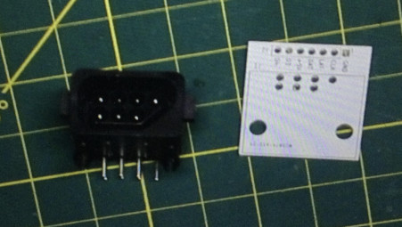

# NES_Controller_Breakout
NES 7 pin controller jack to 0.1" pin header breakout board
  
This pcb takes right angle 7 pin NES controller jacks and provides all pins on a 0.1 inch pitch pin header. 
The connectors were obtained on AliExpress https://s.click.aliexpress.com/e/_DeBYg1V
There are non right angle versions also, which have a different row spacing between the two rows of pins. 
It is best to obtain the exact connectors being used first, verify the measurements of the pin spacings, row spacing, pin diameter, and the plastic peg spacing and diameter. 
Then compare the measurements against the pcb design in case the specs have changed on the connector.
    
